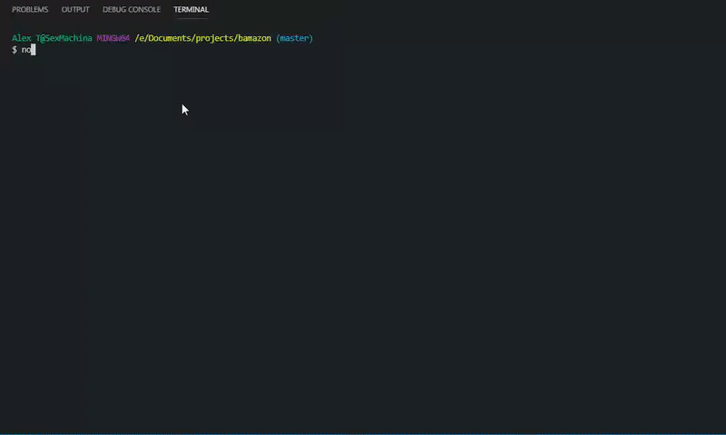

# Bamazon
This is a Cli based Amazon-like store front creating using MySQL database. The app will take in orders from customers and deplete stock from the store's inventory. It will allow the manager to view, restock, and add new products to the store. It will also allow the supervisor to view profits by department and to create new department(s).
An Amazon-like storefront CLI application using MySQL and Node.js. It can take in orders from customers and deplete stock from the store's inventory.

## Technologies
  * JavaScript
  * Node.js
  * MySQL
  * Inquirer.js
  * npm - table
  * npm - mysql

## Installation & Set Up
  1. Clone/download this repository.
  2. Run `npm install`.
  3. Connect to a MySQL server
  4. Update `user` and `password` from the default of `root` in `Model.js` if necessary.
  5. Run MySQL code in `schema.sql` to set up the database and tables for this program.
  6. Nagigate to the folder in which `bamazonCustomer` is saved to start the program by running `node index.js` in the command line.

## Usage Example

